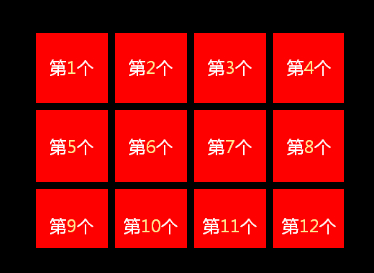
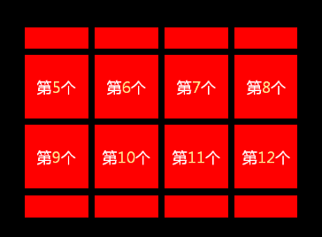

# Quick-Cocos2dx-ext
基于Quick-cocos2d游戏引擎的相关扩展，方便后续的开发使用 http://www.cocos2d-lua.org
## 用法
	-- 引入文件
	require("third.init")
	require("utils.CocosEx")
	
### 1.富文本
	local txtTemp = UIRichTextEx.new("")
	txtTemp:setAnchorPoint(cc.p(0, 0.5))
	txtTemp:setPosition(cc.p(0, 0))
	txtTemp:setString("没有颜色<t c='#FFEE94'>有颜色</t>")

### 2.格子列表，暂时只支持竖向滚动
	-- 传统的列表控件一般都是一次性加载所有格子，当数量太多时会导致一定卡顿现象，体验相当不好
	-- 格子列表控件只加载当前可视区域内的格式，一般用于游戏背包列表功能

	-- 面板可视化（滚动）区域大小
	local oGridSize = cc.size(430, 300)
	-- 每个格子的大小
	local oGridCellSize = cc.size(100, 100)
	-- 每行放多少个格子
	local nColCount = 4
	-- 格式间距, x横向，y纵向
	local oGridCellMargin = cc.size(10, 10)
	local oGridViewCom = UIGridView.new(oGridSize, oGridCellSize, nColCount, oGridCellMargin)
	oGridViewCom:addTo(self.Root):pos(400, 200)
	-- 格子数据源
	local oGridDataSource = {}
	oGridDataSource = {
		-- 格子总数接口（必须实现）
		getDataCount = function( self, ...)
			return 1000
		end,
		-- 格式数据接口（必须实现）
		getData = function (self, idx)
			return { nIndex = idx,}
		end,
		-- 创建格子（必须实现）
		createGridCell = function(self, idx)
			local oData = self:getData(idx)
			local node = display.newColorLayer(cc.c4b(0xff, 0x00, 0x00, 0xff))
			node:setContentSize(cc.size(100, 100))
			local txtTemp = UIRichTextEx.new("")
			txtTemp:addTo(node):alignToCenter()
			-- 格子数据装载接口（必须实现）
			function node:onCellData(oCellData)
				txtTemp:setString(string.format( "第<t c='#FFEE94'>%d</t>个", oCellData.nIndex ))
			end
			node:onCellData(oData)

			return node
		end
	}
	-- 设置数据源
	oGridViewCom:setDataSource(oGridDataSource)
	oGridViewCom:refillCells()

### 3.未完待续。。。
